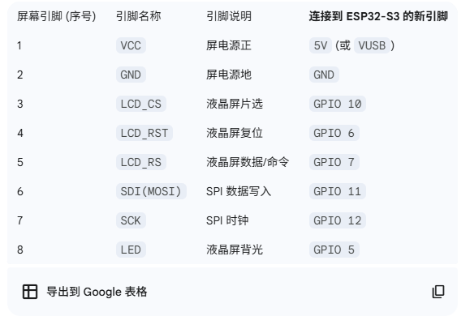
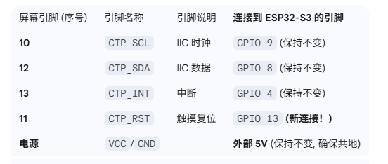
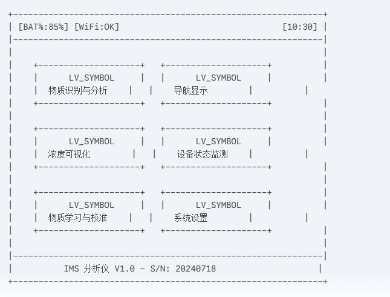
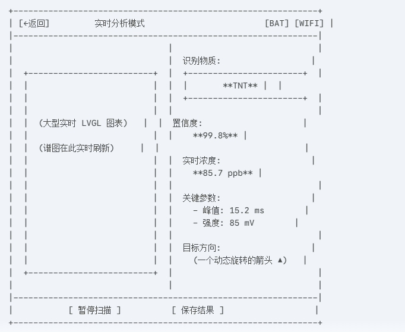
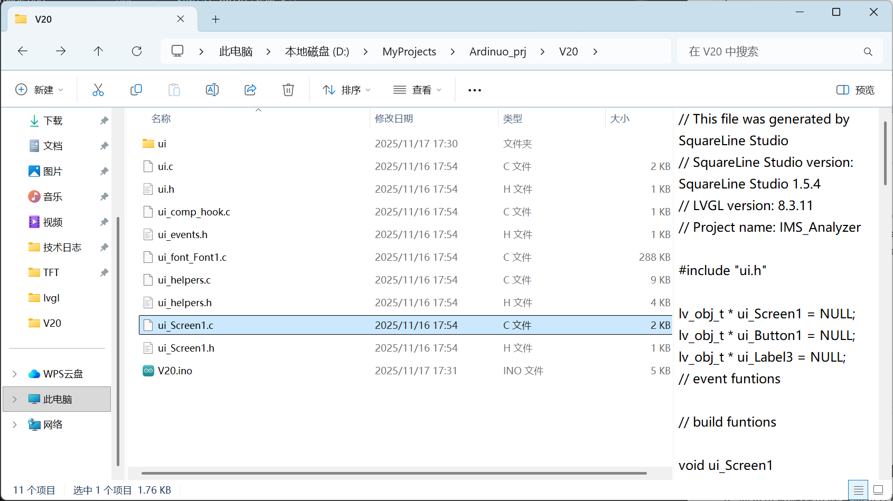
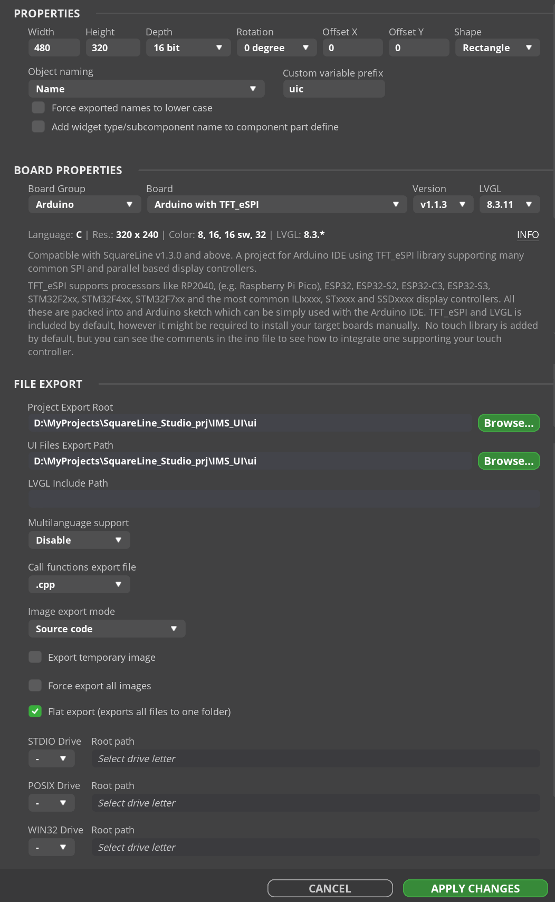
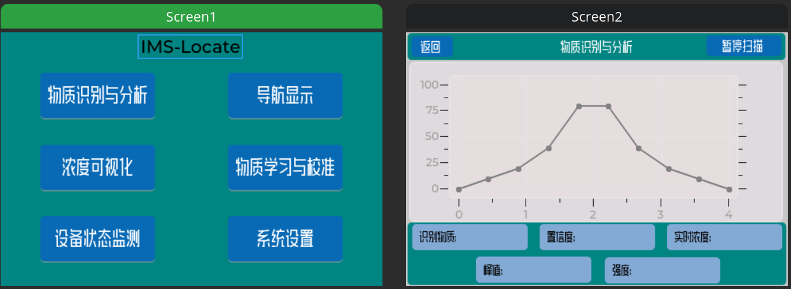

# ESP32-S3驱动TFT屏幕（UI界面设计）
屏幕介绍：https://www.lcdwiki.com/zh/3.5inch_IPS_SPI_Module_ST7796#%E4%BA%A7%E5%93%81%E5%9B%BE%E7%89%87
AI问答（防止号没了）：https://gemini.google.com/share/2771fdb84d10
单片机型号：**ESP32-S3-WROOM-1-N16R8**

>**具体参数：**

>**N16:**  16 MB 的 Quad SPI Flash (闪存)
**R8:**  8 MB 的 Octal SPI PSRAM (伪静态随机存取存储器)

>**核心处理器 (CPU)**
核心： Xtensa® 双核 32-bit LX7 微处理器
时钟速度： 最高可达 240 MHz
片上内存 (SRAM)： 512 KB   
（这是“极速内存”,它就在 CPU 旁边，存取速度最快，但容量较小。
关键数据暂存： 用于存储程序的堆栈 (Stack)、中断服务程序 (ISR) 和最核心的变量。）
只读内存 (ROM)： 384 KB
（这是出厂时烧录好的“固化代码”，不可修改。它包含了 ESP32-S3 的启动程序 (Bootloader) 和一些基础的底层函数库（如蓝牙协议栈的底层）。它在幕后默默工作，确保芯片能启动。）
RTC 内存： 16 KB SRAM in RTC
（这是“低功耗内存”。当您让 ESP32-S3 进入深度睡眠 (Deep Sleep) 模式以省电时，主 CPU 会关闭，SRAM 数据会丢失，但 RTC 内存依然由电池（如有）供电保持数据。）

>**外部存储 (N16R8 的关键)**
Flash (闪存)： 16 MB (Quad SPI)
（用于存储您的程序、LVGL 库、图片、字体和数据库。这是您的“硬盘”。断电后数据不丢失。标准的 ESP32 通常只有 4MB，而您有 16MB，非常巨大。）
PSRAM (内存)： 8 MB (Octal SPI)
（用于 UI 绘图缓冲区、图表数据、ADC 采样阵列和深度学习模型。这是“扩展内存”。它的速度比 SRAM 慢一点，但比 Flash 快得多，而且容量是 SRAM 的 16 倍！）

>**无线通信**
Wi-Fi 协议： IEEE 802.11 b/g/n
Wi-Fi 频率： 2.4 GHz (2412 ~ 2484 MHz)
Wi-Fi 速率： 802.11n 模式下最高可达 150 Mbps
蓝牙协议： Bluetooth 5 (LE), 支持 Bluetooth mesh
蓝牙速率： 125 Kbps, 500 Kbps, 1 Mbps, 2 Mbps
## 一、AI提问
### 1.屏幕移植
1.  现在我要用ESP32-s3开发板来开发这块屏幕（离子迁移谱分析仪显示功能），并且在上面进行UI设计，用ADC采集到微弱的电压信号后用ESP32系统进行分析，最终目的是与数据库中的物质成分进行比对，分析出采集进的电压信号相对应的物质，并且显示在屏幕中。目前我要怎么开始（使用ardinuo开发）
2.  在工具栏上点击“上传”图标，Ardunio IDE将会编译并将固件下载到ESP32S3开发板上（注意：在这一步之前需要选择通过哪个串口连接到开发板，每个计算机有多个串口，要注意区分；每个开发板的LED_BUILTIN引脚定义不一样，要注意更改，这个开发板的LED_BUILTIN引脚要在引脚定义文件里作如下修改），下载完毕后固件会自动运行。
3.  为什么9号引脚不用接
4.  我可不可以这样认为:当我的开发板要接其他外设，比如触控屏还有用lvgl开发的话只需要将驱动文件加载到库地址中，然后改用户设置文件代码设置成我自己开发板适用的就可以进行开发了
5.  所以说比如我要驱动一个TFT的显示屏，那么只要是TFT的显示屏，它的库文件都是同一个，只需要根据自己显示屏是哪种不同的芯片来进行配置录文件就可以了吗
怎么调出引脚定义文件
6.  我在ardiuno中运行代码时，让我选择开发板和串口，我用的s3开发板可能不是官方的，那我应该如何选择，还有我用ardiuno开发不用下载串口驱动，当时我用python需要安装这是为什么
7.  我成功解决了这个问题，驱动了显示屏，现在要驱动触摸屏，此时我有一个顾虑，显示屏驱动我用了8个引脚，触摸屏也需要6个左右，后续我的开发板还需要实现外接高速ADC采集，还需要生成PWM波驱动我的离子门，还需要对采集的信号进行信号处理，还可能使用深度学习来处理，我的开发板引脚够用吗，哪些引脚是可用的
8.  你直接分配了引脚，这个不用配置库文件吗，系统怎么知道触摸屏和单片机那些引脚连接
9.  在确保电源没有问题以及连线也没有问题的情况下，我怀疑是下载的FT6206的库与我的触摸屏FT6336的库不相同，我刚才找到了商家提供的FT6336库，文件名为FT6336-arduino，我将它移植了过来，这些库是通用的吗，现在我要如何测试是否正确
### 2.UI设计
1. 本系统的初始 UI 设计以实现目标物质识别功能为核心。例如，当仪器对 TNT 等特定物质进行“嗅探”后，界面将实时呈现对应的离子迁移谱图，并在随后的分析页面中展示物质判别结果及相关参数。该分析页面作为一个独立的功能子界面，是系统中的关键模块之一。     
   在系统主界面，用户应首先看到多个功能菜单。除了“物质识别与分析”模块之外，其他核心功能还包括导航显示界面、目标物质浓度可视化界面、设备状态监测等。因此，UI 的总体结构需要兼顾功能分类清晰、操作路径简洁，以及在复杂环境中的可读性与可靠性。

2. 我目前在用ESP32-S3-WROOM-1-N16R8开发板驱动一块3.5英寸TFT屏幕，该屏幕分辨率为320xRGBx480 (pixels)，采用4线制SPI串行总线，并且同时具备显示屏和触摸屏功能，显示屏驱动IC为ST7796U，触摸屏驱动IC为FT6336U。我的开发板开发采用Ardinuo平台，在该平台上：1.我已经成功下载并安装了TFT_sSPI、FT6336、lvgl（8.3.11版本），并且通过案例验证能成功驱动触摸屏和显示屏。2.在完成准备工作后，我要在该屏幕上进行UI设计，随即使用SquareLine Studio软件进行ui设计，首先简单使用该软件放置了一个按钮，然后导出了一系列ui.c和ui.h文件，想编写一个验证代码，验证我使用该软件设计的ui可以成功移植到我的ardinuo平台进行使用，请你帮我编写一个验证代码，需要什么信息请及时告知我。

### 3.UI设计与模拟信号进行耦合
1. 请你先详细的介绍一下离子迁移谱分析仪采集未知物质的信号后呈现在屏幕上的波形是什么样的，坐标系的横轴和纵轴的单位间隔是多大，如何能根据波形来判断是什么物质，详细解释其原理。在此基础上，我要用我的3.5寸的显示屏来显示该波形，那么我的波形应该怎样设计

2. 离子迁移谱分析仪的工作实际原理，比如我要检测TNT，但其中还夹杂有其他物质，那么仪器的显示屏上会出现所有物质的名称吗还是我要提前输入一种物质，仪器吸入气体进行分析来找有没有提前输入的物质，对于使用的原理流程请做具体的说明

3. 1.rip峰和我的目标物质产生峰的横轴位置是不是根据自己的离子迁移管的不同而有所差异，所以现在在模拟阶段，对于半透明的红/蓝区域，如果在 Chart 上方叠加半透明的 Panel 控件，相当于已经定死了漂移时间，而我现在还不知道rip峰应该是多少漂移时间，这样理解正确吗？2.该波形的纵坐标单位是什么，代表什么物理含义，一般大小是多少？3.我点击开始采样，是不是目标物质产生的峰会一直出现，当我暂停采样后，峰就会消失，如果是这个设计逻辑，rip峰会一直存在吗，为什么产生的是这样的峰

4. 假设我已经在Squareline软件中设计好了ui界面，也就是坐标系和波形，按照一般流程，我会导出该ui项目生成一系列.c和.h文件，之后将这些文件放入我的ardinuo项目文件夹中，运行我的.ino文件将ui移植到我实际的屏幕中。那么我要用ESP32—S3采集的信号怎样呈现在我的ui波形图中呢，现在我先模拟一个采集的信号能呈现在我的ui波形图中，当我采集到真实信号后，我只需要将真实信号包装一下替换掉模拟的信号，代码中只需换一个接口函数之类的即可，这种功能能实现吗？那么我应该怎样实现生成的模拟信号能呈现在我设计的ui界面上，Squareline软件导出的是包装好的文件，需要改这些文件来将两者联系起来吗，具体要怎么操作，不需要生成具体的代码，告诉我一个严密的思路

5. 现在需要你帮我实现一个复杂的任务（使用ardinuo平台开发）：当我给我的ESP32S3上电时，屏幕上就开始显示一个RIP的波形（相当于我启动了我的离子迁移谱分析仪，此时空气开始被电离，能出现rip波形证明仪器正常运转）。当我点击右上角的开始扫描按钮时，按钮变成绿色，并且框内文字变成暂停扫描，同时代码端开始模拟产生一个物质的波形，此时屏幕上除了RIP波形还有物质的波形。当我再次点击右上角按钮暂停扫描时，按钮内文字又恢复为原来的开始扫描，按钮颜色变为蓝色，屏幕上只剩下RIP波形；于此同时，在物质的波形出现的这段时间内，ui界面波形显示下面的漂移时间框内要显示物质波形的峰所在的漂移时间（跟随波形变化而变化），以及物质波形的峰的信号幅值（跟随波形变化而变化）。请你根据我的要求理清思路，在Squareline软件中要留哪些接口，以及代码（.ino文件）应该怎么写，我将提供给你以下代码作为参考（此代码用来将squareline软件实际的ui移植到屏幕中显示）：

###  4.Ardinuo项目移植到VScode

1. 在之前的ardinuo项目文件中，我的库文件有些官方没有，是我自己找的如图1，可以直接移植过来而不下载吗？项目文件所有内容显示在图2，而且显示屏的引脚信息定义在TFT_eSPI库文件的User_Setup代码中，触摸屏的引脚信息定义在我的.ino代码中，以下是我的.ino代码：
2. 我目前所做的工作是将我的一个Arduino项目（用ESP32-S3-WROOM-1-N16R8开发板驱动一块3.5英寸TFT屏幕，该屏幕分辨率为320xRGBx480 (pixels)，采用4线制SPI串行总线，并且同时具备显示屏和触摸屏功能，显示屏驱动IC为ST7796U，触摸屏驱动IC为FT6336U，联合Squareline软件设计的UI界面，已经成功设计的UI项目）我已经使用ardinuo平台成功开发了UI设计的功能，目前需要移植到Visual Studio Code + PlatformIO 插件，在将相关文件和代码移植过来后，碰到了如下串口发送过来的报错：ELF file SHA256: 864b863ef1749027 

   Rebooting...
   ESP-ROM:esp32s3-20210327
   Build:Mar 27 2021
   rst:0xc (RTC_SW_CPU_RST),boot:0x8 (SPI_FAST_FLASH_BOOT)
   Saved PC:0x4202659a
   SPIWP:0xee
   mode:DIO, clock div:1
   load:0x3fce3808,len:0x4bc
   load:0x403c9700,len:0xbd8
   load:0x403cc700,len:0x2a0c
   entry 0x403c98d0

   --- TEST START ---
   Backlight (21) ON...Done
   TFT Init...Guru Meditation Error: Core  1 panic'ed (StoreProhibited). Exception was unhandled.

   Core  1 register dump:
   PC      : 0x4200283f  PS      : 0x00060830  A0      : 0x82002930  A1      : 0x3fcebbd0  
   A2      : 0x00000010  A3      : 0x00000000  A4      : 0x60004000  A5      : 0x00000010
   A6      : 0x000000ff  A7      : 0x00000000  A8      : 0x08000000  A9      : 0x3fcebba0  
   A10     : 0x3fc9727c  A11     : 0x00000001  A12     : 0xffffffff  A13     : 0x00000020
   A14     : 0x00000000  A15     : 0x3fc94238  SAR     : 0x00000010  EXCCAUSE: 0x0000001d  
   EXCVADDR: 0x00000010  LBEG    : 0x42017878  LEND    : 0x420178dc  LCOUNT  : 0x00000003  


   Backtrace: 0x4200283c:0x3fcebbd0 0x4200292d:0x3fcebc00 0x420019d1:0x3fcebc20 0x4200508e:0x3fcebc50现象为单片机黄灯不断亮起，而且串口不断发送过来这种报错，这是什么原因引起
3. 

   


## 二、开发过程
### 1.点亮显示屏（ST7796）
1.  安装 TFT_eSPI 库
打开 Arduino IDE。
确保已安装 ESP32 开发板支持包。
前往 项目 > 加载库 > 管理库...。
搜索 "TFT_eSPI" 并安装 Bodmer 开发的那个库。
1.  配置库 (最关键的一步)
在你的电脑上，找到 Arduino 库文件夹 (通常在 我的文档\Arduino\libraries\)。
进入 TFT_eSPI 文件夹。
找到 User_Setup.h 文件，用文本编辑器打开它。
1.  结合AI对User_Setup.h文件进行配置，直接让AI帮我生成配置文件，塞进去运行缺少相关库文件，进行安装：
    >您正在尝试编译的示例 (TFT_flash_jpg) 需要两个库才能工作：
    >TFT_eSPI.h (您已经有了，用来驱动屏幕)
    >JPEGDecoder.h (您没有，用来解码 JPG 图片文件)

    >🚀 解决方法：安装 JPEGDecoder 库
    您需要通过 Arduino IDE 的“库管理器”来安装它。
    打开您的 Arduino IDE。
    点击菜单栏：工具 (Tools) > 管理库... (Manage Libraries...)。
    (或者 项目 > 加载库 > 管理库...)
    库管理器窗口将会打开。在搜索框中，输入 JPEGDecoder。
    在搜索结果中，找到由 Bodmer (和 Makoto Kurauchi) 编写的库。
    （选择 Bodmer 的版本很重要，因为它能确保与他的 TFT_eSPI 库完美兼容）
    点击“安装” (Install) 按钮。
    安装完成后，重新启动您的 Arduino IDE（这是一个好习惯）。
    再次打开您的 TFT_flash_jpg 项目，点击“上传”
2.   连接单片机引脚与显示屏:

```C++
// ###### EDIT THE PIN NUMBERS IN THE LINES FOLLOWING TO SUIT YOUR ESP32 SETUP   ######

// 您的新配置
#define TFT_MOSI 11  // 对应屏幕引脚 6 - SDI(MOSI)
#define TFT_SCLK 12  // 对应屏幕引脚 7 - SCK
#define TFT_CS   10  // 对应屏幕引脚 3 - LCD_CS
#define TFT_DC   7   // 对应屏幕引脚 5 - LCD_RS
#define TFT_RST  6   // 对应屏幕引脚 4 - LCD_RST
#define TFT_BL   5   // 对应屏幕引脚 8 - LED
#define TFT_BACKLIGHT_ON HIGH // 设置背光点亮电平
```
5.  配置文件修改完成之后，需要以下内容来测试屏幕是否正常工作：
    >   **第 1 步：重启 Arduino IDE (关键！)**
        在您做任何其他事情之前，请先完全关闭 Arduino IDE，然后再重新打开它。
        理由： Arduino IDE 在启动时才会加载库的配置文件。如果您不重启，它可能会继续使用 您修改 User_Setup.h 之前的旧的、错误的配置。    
        **第 2 步：打开 Colour_Test 示例**
        (重启后) 打开 Arduino IDE。
        点击菜单栏： 文件 > 示例 > TFT_eSPI > TFT_Diagnostics > Colour_Test
        一个新的代码窗口会打开，里面是 Colour_Test 程序的代码。
        **第 3 步：配置开发板并上传**
        用 USB 线连接您的 ESP32-S3 开发板。
        点击菜单栏： 工具 > 开发板 > ESP32 Arduino > 选择 ESP32-S3 Dev Module。
        点击菜单栏： 工具 > 端口 > 选择您的 ESP32-S3 对应的 COM 端口。 (如果不确定是哪一个，请拔掉 S3，查看列表；再插上 S3，新出现的那个就是它。)
        点击工具栏上的“上传”按钮（向右的箭头图标）。
        **第 4 步：验证结果 (看屏幕)**
        如果一切成功： Arduino IDE 会显示“编译草图...”、“上传...”、“连接中...”Hard resetting via RTS pin..，最后显示“上传成功”。
        在“上传成功”的瞬间，您的屏幕应该会“点亮”，并开始显示全屏的色块（红、绿、蓝...）、旋转的线条和一些测试文字。   
        如果屏幕亮了并显示了 Colour_Test： 恭喜您！ 您的硬件接线正确，并且您的 User_Setup.h 配置文件100% 正确。您的第一步已完美达成。
6.  在配置好文件后，一切准备就绪，上电烧录上述测试代码，出现问题：**烧录好的一瞬间屏幕点亮，亮起时间不足一秒又立马熄灭，按reset键又短暂重新亮起** （屏幕亮起的一瞬间能显示测试代码内容，可以说明接线以及测试代码都没有问题）。
   
    **可能出现的问题**
    - **供电的问题：** 屏幕供电3.3V不够用（ ESP32-S3 和屏幕背光在启动瞬间的总电流消耗，超过了您当前 USB 供电所能提供的瞬时最大电流，导致 ESP32-S3 芯片电压跌落并崩溃重启。），需要接5V供电（商家标注该屏幕3.3V/5V供电都可行，找不到其它出错的可能，只能尝试5V供电是否可行），然而开发板上没有5V供电接口，只能去实验室进行试验，在接上5V电源后依然短暂亮起又熄灭，问题没解决。
    - **配置文件的问题:** 仔细重新一步一步看了User_Setup.h文件的配置情况，发现问题所在：**背光是“低电平”点亮的，而我将其设置成了高电平**。将 `#define TFT_BACKLIGHT_ON HIGH `更改为`#define TFT_BACKLIGHT_ON LOW`,成功解决问题。
### 2.点亮触摸屏（FT6336）
1. 和上述显示屏一样，首先在Arduino IDE中下载相关库
    >您的芯片是 FT6336U。在 Arduino 生态中，它通常与 FT6206 / FT6236 芯片的驱动库兼容。
    我们将安装最常用的 Adafruit FT6206 库。
    打开您的 Arduino IDE。
    点击菜单：项目 > 加载库 > 管理库... (Sketch > Include Library > Manage Libraries...)
    在库管理器顶部的搜索框中，输入：Adafruit FT6206
    在结果中找到 "Adafruit FT6206 Library"，点击“安装”。
    IDE 可能会提示您安装此库的依赖库 (Dependencies)，例如 Adafruit BusIO。请点击“全部安装 (Install All)”。

    经过运行测试代码，发现屏幕发光但是全黑，最终发现问题是：**软件中直接下载的库文件与该屏幕并不兼容，之后换成了商家给的库文件，问题解决。** 库文件地址：`D:\MyProjects\Ardinuo_prj\libraries`
2. 这是商家提供的FT6336库中所有的文件，请详细分析，为什么触摸屏的库文件中只有两个代码文件，这合理吗`D:\MyProjects\Ardinuo_prj\libraries\FT6336`
    >这是 C++ (Arduino) 库的标准结构，也是最精简的结构：
    **.h (头文件): FT6336.h**
    作用： 这是“公开的合同”或“说明书”。
    它定义了 class FT6336，告诉编译器（和我们）：这个库“有什么”功能。
    它列出了所有公有 (public) 函数（我们能用的，如 begin）和私有 (private) 函数（我们不能用的，如 readPoint），以及所有的变量。
    **.cpp (实现文件): FT6336.cpp**
    作用： 这是“内部的实现”或“代码逻辑”。
    它包含了 .h 文件中声明的所有函数的实际 C++ 代码，告诉微控制器这些功能“怎么做”。
    一个库可以有 examples 文件夹或 keywords.txt 文件，但要让库工作， .h 和 .cpp 是唯二必需的文件。
3. 一开始只接了3根线，跟据AI大人的指示，触摸复位引脚没什么用不用接，但是不管怎么测试都会出错，甚至怀疑是硬件层出现问题，不是代码的问题（AI：**我 100% 肯定是由 SPI 总线 (显示屏) 和 I2C 总线 (触摸屏) 之间的硬件冲突或噪声引起的。当您在 loop() 中同时高速访问它们时，面包板和杜邦线上的信号干扰导致了系统崩溃。** ）
    *AI终于发现了问题所在，尝试后成功解决！*
    >新的发现 (来自库文件)
    通过分析您提供的 FT6336.cpp 文件，我发现了一个关键问题：
    ts.begin() 函数会调用 ts.reset()。
    ts.reset() 函数会主动控制 pinRst 引脚。
    在 V8 代码中，我们将 CTP_RST_PIN 设置为 -1 (未连接)。
    这很可能是 ts.begin() 失败的根本原因！ digitalWrite(-1, ...) 可能会导致未定义的行为。
    我们必须连接 CTP_RST 引脚。
    

    触摸屏不用配置文件，只需要将引脚接线的信息在自己写的代码中定义即可，测试代码地址：`D:\MyProjects\Ardinuo_prj\TFT\cmp_xsp_test`
4. 显示屏和触摸屏联合显示代码：`D:\MyProjects\Ardinuo_prj\TFT\cmp_xsp_test`
5. 在嵌入式开发市场（Arduino/ESP32 周边），3.5寸、2.8寸、2.4寸这些 TFT 屏幕，**本质上都是当年智能手机产业链剩下的模具或库存技术**。故此触摸屏天生竖屏，需要在代码中进行矫正来转换为横屏。
### 3.lvgl库(8.3.11)
1.  lvgl为应用层，也需要对该库进行配置：
    >导航到 Arduino libraries 文件夹 (` d:\MyProjects\Ardinuo_prj\libraries\`)。
    进入 lvgl 文件夹。
    找到 lv_conf_template.h 文件。
    复制和重命名：
    复制这个文件，并原地粘贴它。
    将副本重命名为 lv_conf.h。
    移动文件 (关键！)：
    剪切 (Cut) 您刚刚创建的 lv_conf.h 文件。
    返回上一级，将其粘贴到根 libraries 文件夹中。
    （最终路径应为：`d:\MyProjects\Ardinuo_prj\libraries\lv_conf.h`）
2. 该配置文件一共1000多行代码，有一些需要注意但不用修改，一些需要修改，配置具体的内容如下：
   **需要修改的：** 
   >1. 启用配置文件 (总开关):`#if 1 /* Set this to "1" to enable content */`
   >2.  演示 (DEMO USAGE):`#define LV_BUILD_DEMOS 0`。
   1会尝试编译 LVGL 自带的演示程序，这会占用大量空间并可能与您的 V18 代码 冲突。您正在构建自己的 UI，所以应将其禁用。

    **需要注意的点：**
    >移动 lv_conf.h 到 libraries 文件夹。
    启用文件 (#if 1)。
    确认 LV_COLOR_DEPTH 是 16。
    确认 LV_USE_CHART, LV_USE_BUTTON, LV_USE_LABEL 都是 1。
    确认 LV_USE_TFT_ESPI 是 0。
    禁用 LV_BUILD_DEMOS (设为 0)。
    您可以 100% 忽略 FONT USAGE, THEMES, 3RD PARTS LIBRARIES 等所有其他部分。默认值都已完美设置。
    **我们的 V18 代码 是通过 lv_display_create(screenWidth, screenHeight); 动态将分辨率（480x320）传递给 LVGL 的，这种方法更灵活**
3.  **深入理解lvgl库文件的移植（与keil MDK等对比）：** 基于正点原子LVGL教程：[正点原子LVGL教程](https://www.bilibili.com/video/BV1CG4y157Px/?spm_id_from=333.337.search-card.all.click&vd_source=b07c2d68fd5e7f096ea1a48a904cc49a)
    - 在Keil MDK 或 STM32CubeIDE那些“专业”或“裸机”环境中，IDE 就像一个“空房间”。当想使用一个第三方库（如 LVGL）时，必须手动完成所有工作：
    >步骤 1：手动复制文件
    步骤 2：手动添加 .c 文件到编译器
    步骤 3：手动添加头文件路径
    步骤 4：启用 C99 模式
    步骤 5：配置 lv_conf.h

    - Arduino IDE 是一个“托管环境”。它的核心价值就是处理所有底层的“工程管理”事务：

    >“步骤 1 & 2 & 3” (自动完成)：
    当在 工具 > 管理库... 中点击“安装” lvgl 库时，Arduino IDE 自动完成了：
    下载并解压所有文件到 libraries 文件夹。
    自动将 lvgl/src 文件夹添加到了编译器的“头文件路径”中。
    自动扫描 lvgl/src 及其所有子文件夹，将所有的 .c 和 .cpp 文件（如 lv_btn.c, lv_chart.c） 添加到了编译列表中。
    “步骤 4” (自动完成)：
    ESP32-S3 使用的 GCC 编译器是一个非常现代的编译器。它默认就支持 C99 和 C++，您根本不需要手动配置它。

    - 当点击“编译”或“上传”时，Arduino IDE 会自动扫描 libraries 文件夹 (例如 D:\MyProjects\Ardinuo_prj\libraries)。当它在里面发现一个 lvgl 文件夹 时，它会自动：
    >寻找 library.properties 或 library.json 文件，以了解这个库。
    自动将 lvgl/src 文件夹 添加到编译器的“头文件包含路径”中。
    自动扫描 lvgl/src 及其所有子文件夹（如 widgets, core, draw），并将所有的 .c 和 .cpp 文件添加到编译任务中。

    - 为什么能扫描到需要的内容：library.properties 和 library.json 都是“库元数据（Metadata）”文件，或称为“清单（Manifest）”。它们的核心作用是向 Arduino IDE “自我介绍”。
    - 而且所有“移植层”（my_disp_flush）和“应用层”（btn_event_cb）的代码都在同一个 .ino 文件中，Arduino IDE 才能“看懂”它们，并自动找到所有需要的库。不需要单独配置移植层的库文件。
### 4.UI设计
1.  主菜单示例：
    
    物质识别与分析模块：
    
2.  SquareLine Studio软件的代码移植
- 1.    加载字体包微软雅黑时失败，原因微软雅黑混合了很多种语言，之后加载**黑体字体** 成功。而且，SquareLine Studio软件**只识别ttf后缀，ttc字体的不行** 。
- 2.    该图形化设计的软件导出设计文件后，应该**直接全部平铺和.ino文件同级** ，否则会出现找不到ui_init头文件。如下图：图中的ui文件夹就是错误示范
- 3.    SquareLine Studio直接导出的是.c文件，Arduino 的主程序（.ino）本质上是 C++，在编译时会将.c文件当作cpp文件来编译，所以**要将.c后缀改为.cpp后缀**。并且直接导出的**c文件有函数类型与cpp不兼容**，  *LVGL 函数 lv_bar_set_value 的第三个参数需要 lv_anim_enable_t (这是一个枚举 enum)，但代码传入的是 int。在 C 语言中这通常是允许的（警告），但在 C++ 中是禁止的（报错）*   ,此时会出现报错，根据AI修改报错即可。
- 4.    在遭遇以上问题并全部解决后，终于成功将SquareLine Studio的图形化设计移植到Ardinuo平台，测试代码位置：`D:\MyProjects\Ardinuo_prj\UI_test`
实物显示如图：
- 5.    在重新设计好ui后，注意到有导出文件设置选项，意识到上次出现的c和c++代码不兼容报错可能与该设置有关，随即对此进行设置，如下图：设置完成后此次运行十分流畅，没出现报错，但屏幕触控不可用（历史遗留问题）
- 6.    在之前代码的基础上只修改了一点，成功解决触摸无反应问题，**修复 LVGL 心跳**（关键修复）： 在 loop 中加入了` lv_tick_inc(5)`。这一点非常重要，如果没有它，LVGL 无法感知时间流逝，会导致“点击”动作无法完成（看起来像没反应），或者长按/滑动失效。自此，这一阶段目标成功实现，制作了两个ui界面如下：
3.  使用SquareLine Studio软件进行UI设计
- 1.    只看了视频的第一节目前能应对设计：https://www.bilibili.com/video/BV1Bu411p7cM/?spm_id_from=333.337.search-card.all.click&vd_source=b07c2d68fd5e7f096ea1a48a904cc49a

### 5.Ardinuo项目移植到VScode

1. 根据AI指示将原Arduino项目下的库文件打包放在新建的Platformio项目文件夹中，需要注意的是：

   > 库一共分为两类：
   >
   > - 通过 `platformio.ini` 管理的库 (TFT_eSPI, LVGL)
   >

	> - 需要手动复制的库 (FT6336,JPEGDecoder)`D:\MyProjects\VScode_prj\ESP32_S3_prj\UI_test\lib`
	>
	
	>   处理 UI 文件 (SquareLine 导出的文件):
	>
	>   - 把旧项目中所有的 `ui_xxx.c`, `ui_xxx.h`, 字体文件 (`.c`) 以及 `ui.c`, `ui.h` 全部复制到 **`src/ui/`** 里面。
	>
	>   处理 LVGL 配置文件 (`lv_conf.h`):
	>
	>   - 把它复制到 PlatformIO 项目的 **`src`** 文件夹根目录下（和 `main.cpp` 在一起）。
	>
	>   代码移植 :
	>
	>   - 根据`.ino` 代码，重构符合 PlatformIO (C++) 规范的 `main.cpp`。


2. 移植最重要的是配置.ini文件，正是由于.ini文件配置问题，导致串口出现`Guru Meditation Error: Core 1 panic'ed`报错，最后加上以下代码：

   ```diff
   -D USE_HSPI_PORT       → 激活 HSPI 总线
   -D TFT_SPI_HOST=HSPI   → 让 TFT_eSPI 使用 HSPI 对应的硬件 SPI 控制器（SPI2_HOST）
   ```

   成功点亮屏幕。

    
