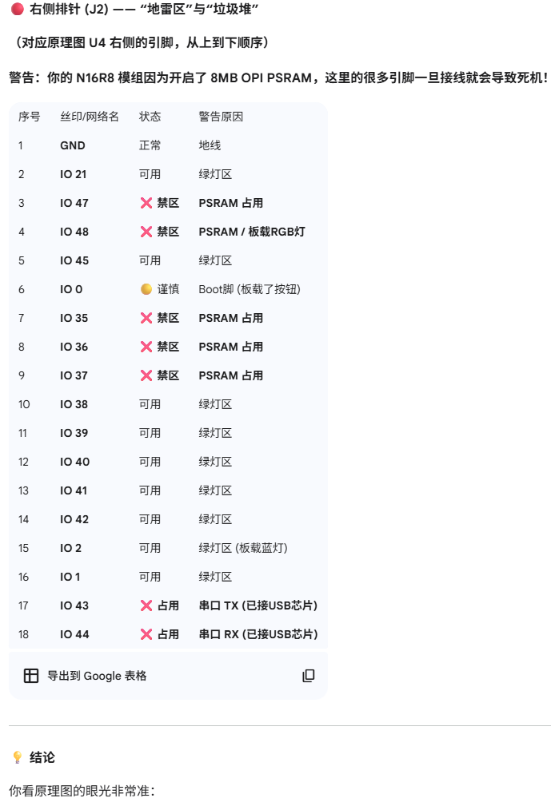

# IMSLAS
ESP32引脚：

## 一、项目概况: 

**基于离子迁移谱的自主化学源定位系统（IMSLAS-Localization and Autonomous Seeking)**

本项目旨在开发一款**基于离子迁移谱的自主化学源定位系统(IMSLAS)**。与仅能对样本进行定性/定量分析的传统IMS设备不同，本系统在保留核心物质识别能力的基础上，创新性地实现了**“识别 + 定位”一体化功能**。设备对目标物质（如特定危险品、污染物）进行“嗅探”校准，提取并存储该物质的离子迁移率谱图特征；将设备搭载于无人机或四足机器人等移动平台，在作业环境中实时监测目标物质的浓度梯度。系统利用**类生物趋化性算法（Chemotaxis Algorithm）**，根据浓度变化实时解算运动矢量，驱动平台向高浓度区域逼近，最终锁定目标物质的精确空间位置，实现从“发现”到“定位”的全自动闭环。本系统基于高性能双核MCU **ESP32-S3-WROOM-1-N16R8** 构建，采用Arduino框架进行嵌入式开发。

按照系统架构，嵌入式软件开发被拆解为以下四个关键技术模块，每个模块都进行了深度的功能定义与逻辑细化：

1. **离子门控时序发生器**

   产生高精度的驱动信号，控制离子门的开闭时序。

2. **交互式人机界面设计**

   **核心任务：** 构建基于3.5英寸TFT屏幕的可视化操作终端。

   **硬件规格：** 分辨率320×480 (Pixel)，采用高效的4线SPI通讯接口；显示驱动IC为ST7796U，电容触摸驱动IC为FT6336U。

   **功能实现：**设计基于事件驱动的UI架构，优化SPI传输效率（如使用DMA传输）以保证高刷新率。

   **六大功能模块划分：**

   1. **物质识别与分析（Analysis）：** 显示当前检测物质名称及置信度；
   2. **实时导航显示（Navigation）：** 显示平台运动轨迹、方向指引及相对位置；
   3. **浓度可视化（Concentration）：** 以波形或色阶形式直观呈现浓度变化趋势；
   4. **物质学习校准（Calibration）：** 录入新物质的谱图特征进行训练；
   5. **系统状态监测（Status）：** 监控高压源、温度、气流及电池电压；
   6. **系统设置（Settings）：** 调节离子门脉宽、采集增益等底层参数。

3. **高速数据采集与信号处理**

   核心任务是捕获微弱的离子流信号并转化为数字谱图。驱动外置高精度、高采样率ADC对经过放大的模拟信号进行离散化采集并且在屏幕上实时绘制“电压-时间”波形（即离子迁移谱图）。计算不同离子峰的**飞行时间（Time of Flight, ToF）**，结合漂移管长度与电场强度，反演计算出物质特有的**迁移率（$K_0$）**，以此作为物质识别的“指纹”依据。利用外置的高速高精度ADC采集电压信号（由离子门进来的被电离的物质产生的电流信号，再经过跨阻放大器得到电压信号），并且将波形呈现在屏幕上，记录不同物质离子的迁移率，根据此可以实现离子迁移谱分析仪的功能。

4. **定位算法设计**

   在实现能分辨出物质功能的前提下，设计循迹算法，使其能精准定位该物质源，并且其浓度和循迹过程可以显示在屏幕上。

## 二、原始要求: 
### 要求1
1.  找到视频教程，
2.  对应的开发板及购买链接
3.  功能有高分辨率高性能的模拟信号采样怎么设计开发
4.  功能信号调制生成信号发生器怎么设计开发
5.  功能图像显示怎么设计开发
6.  功能信号处理怎么设计开发
7.  根据离子迁移谱仪检测过程的功能机器交互怎么设计和开发
### 要求2
1. ESP32型号问题，有很多ESP的小类型，帮我弄清楚那些类型分别有什么功能和优势

2. MCU和ADC采样间的通信问题，如果是用总线，用哪种总线，能否保证采样速率

3. DAC输出是PWM方波的脉冲宽度边界是多少，IMS需要用到的是至少要达到50us的脉冲宽度，周期是20ms

### 要求3（跨阻放大器）

   1. 参数可调，10^9倍电流转电压，最大300us的延时长`D:\WorkSpace\科研\微电流放大器\项目资料`

  

## 三、AI提示词：
-  [ESP32-S3 离子迁移谱信号采集](https://gemini.google.com/share/c4a958ed4ce8)
-  [ESP32-S3 IMS 数据采集与分析](https://gemini.google.com/share/3618347ee2a4)
-  [Arduino代码移植到VScode](https://gemini.google.com/share/3aced94b5d8d)
-  [ESP32S3对TFT屏幕UI界面设计](https://gemini.google.com/share/f613719c6c7a)
-  [离子迁移谱仪UI界面设计](https://gemini.google.com/share/af33cce52c3d)
-  [ESP32S3对TFT屏幕的开发](https://gemini.google.com/share/b982b09363f3)
## 1. 离子迁移谱分析仪系统
1.  我要用esp32开发板做一个离子迁移谱分析仪，目前要做的工作是整个仪器的嵌入式系统开发，要实现采集空气中微弱的被电离的离子信号，需要高精度高性能的采集，应该如何实现
2.  esp32能否实现以下功能：由于我们最终目的是采集气体分子从而分析其成分，数据处理系统记录下每个离子峰的到达时间（漂移时间）和信号强度,在特定的操作条件下（如温度、压力、电场强度等），每种离子的漂移时间是其特征值,通过将测得的漂移时间与标准数据库中的数据进行比对，即可快速、准确地鉴定出样品中含有的化学物质及其大致浓度。这个过程中需要进行大量数据的比对，是否需要进行人工智能算法来实现，esp32的性能能否达到要求
3.  使用ESP32采集法拉第杯提供的微弱电压信号，应该选择外置的ADC来采集，有哪些指标要求，具体应当如何实现
4.  我需要使用ESP32来产生一个方波信号用于高压方波发生器的输入端，经过高压方波发生器将信号放大产生高压方波用于离子门的开通和关断。用ESP32来产生一个方波信号这个功能应当如何实现
5.  在采集完信号后，要进行结果和分析过程等等的显示，屏幕上应该显示哪些数据，这个功能的实现要用到什么技术，怎样实现
6.  我用ADC采集到微弱的电压信号后用ESP32系统进行分析，最终目的是与数据库中的物质成分进行比对，分析出采集进的电压信号相对应的物质，这是整个嵌入式系统中核心的功能，具体要怎样实现，需要用到什么技术
7. ESP-S3和外置ADC采样（采集空气中微弱的被电离的离子信号，需要高精度高性能的采集）间的通信问题，如果是用总线，用哪种总线，能否保证采样速率
8. 假设我用外置ADC采集到微弱的电压信号，我要将这个信号与我自己的信号进行比对，分析是哪种物质，并且将信息呈现在显示屏中，这个代码怎么实现
9. python中一些变量的命名规则，合理的命名
10. 我现在已经搭建好了基于micro python开发的ESP32-S3环境，我要用ADC采集到微弱的电压信号后用ESP32系统进行分析，最终目的是与数据库中的物质成分进行比对，分析出采集进的电压信号相对应的物质，并且显示在屏幕中，我应该采购怎样的显示屏，怎样实现这个功能
11. 我现在主要用esp32实现以下功能：由于我们最终目的是采集气体分子从而分析其成分，数据处理系统记录下每个离子峰的到达时间（漂移时间）和信号强度,在特定的操作条件下（如温度、压力、电场强度等），每种离子的漂移时间是其特征值,通过将测得的漂移时间与标准数据库中的数据进行比对，即可快速、准确地鉴定出样品中含有的化学物质及其大致浓度。这个过程中需要进行大量数据的比对，并且最终在屏幕上显示出来。目前离子迁移谱仪整个系统主要先将屏幕显示功能和ADC采集功能做出来，但由于没有实际的采集系统，我们需要先生成一个假信号模拟采集进来的信号显示在屏幕上，目前我刚刚才配置好ESP32S3开发环境，接下来应该怎么进行，计划是什么
12. 